# ChurchCore Care — Phase A & B: SaaS Launch Plan

**Date:** May 26, 2026
**Status:** Code complete — infrastructure/admin tasks remaining
**Author:** Engineering — AI Factory pipeline
**Branch:** `feature/mantine-ui`

> **Implementation sprint summary (May 26, 2026):** All backend services, API routes, DB migrations, frontend components, and unit tests for Phase A1/A2/A4 and Phase B1/B2/B3 were implemented. 95/95 unit tests pass. Remaining items are infrastructure ops tasks (GCP deploy, Stripe Dashboard setup, Stedi account), not code. See [Master TODO Tracker](#5-master-todo-tracker) for full checklist status.

This document is the canonical source of truth for the Phase A (launch blockers) and Phase B (90-day post-launch) execution plan. It covers architecture, user stories, technical specs, implementation TODOs, how-to guides, and ADR decisions for all seven features.

---

## Table of Contents

1. [Current State Map](#1-current-state-map)
2. [Target Architecture](#2-target-architecture)
3. [Phase A — Launch Blockers](#3-phase-a--launch-blockers)
   - [A1: Multi-Tenant SaaS Phase 4](#a1-multi-tenant-saas-phase-4)
   - [A2: Stripe Subscription Billing](#a2-stripe-subscription-billing)
   - [A3: GCP Production Deployment](#a3-gcp-production-deployment)
   - [A4: 30-Day Free Trial Flow](#a4-30-day-free-trial-flow)
4. [Phase B — Competitive Parity](#4-phase-b--competitive-parity)
   - [B1: AI Session Note Drafting](#b1-ai-session-note-drafting)
   - [B2: EDI Clearinghouse Integration](#b2-edi-clearinghouse-integration)
   - [B3: Insurance Eligibility Verification](#b3-insurance-eligibility-verification)
5. [Master TODO Tracker](#5-master-todo-tracker)
6. [ADR Index](#6-adr-index)
7. [How-To Guides](#7-how-to-guides)

---

## 1. Current State Map

### What is already built (as of v6.1.0)

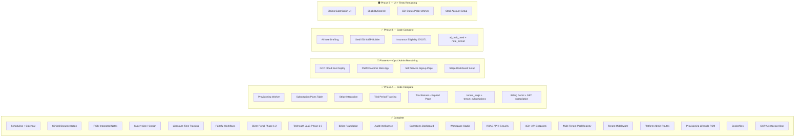

### Key infrastructure already in place

| Component | File | Status |
| --- | --- | --- |
| Multi-tenant pool registry | `apps/api/src/db/pools.js` | ✅ Complete |
| Tenant middleware (host routing) | `apps/api/src/middleware/tenant.js` | ✅ Complete |
| Provisioning lifecycle FSM | `apps/api/src/lib/tenant-provisioning.js` | ✅ Complete |
| Provisioning DB table | `schema.sql: tenant_provisioning` | ✅ Complete |
| Platform admin routes | `/v1/platform/*` (6 routes) | ✅ Complete |
| Billing tables (invoices, claims, superbills) | `schema.sql` | ✅ Complete |
| Billing query layer | `apps/api/src/db/queries/billing.js` | ✅ Complete |
| Claims table | `schema.sql: claims` | ✅ Complete |
| Insurance table | `schema.sql: client_insurance` | ✅ Complete |
| API Dockerfiles | `apps/api/Dockerfile`, `apps/worker/Dockerfile` | ✅ Complete |
| GCP architecture doc | `docs/cloud-implementation.md` | ✅ Complete |
| Stripe integration | `apps/api/src/lib/stripe.js`, `billing-webhooks.js` | ✅ Code complete |
| Stripe webhook route | `POST /webhooks/stripe` (index.js) | ✅ Code complete |
| Subscription plans table | `apps/api/src/db/migrate.js` — `tenant_subscriptions` | ✅ Code complete |
| Tenant slugs table | `apps/api/src/db/migrate.js` — `tenant_slugs` | ✅ Code complete |
| Tenant query layer | `apps/api/src/db/queries/tenants.js` | ✅ Code complete |
| Provisioning worker | `apps/worker/src/provision.js` | ✅ Code complete |
| Trial banner + expiry | `apps/web/src/components/TrialBanner.jsx` | ✅ Code complete |
| Trial expired page | `apps/web/src/pages/TrialExpiredPage.jsx` | ✅ Code complete |
| Trial status hook | `apps/web/src/lib/useTrialStatus.js` | ✅ Code complete |
| Billing routes | `GET /v1/billing/subscription`, `POST /v1/billing/portal` | ✅ Code complete |
| EDI clearinghouse | `apps/api/src/lib/stedi.js` (837P builder + submission) | ✅ Code complete |
| AI note drafting | `apps/api/src/lib/ai-notes.js` + route + frontend panel | ✅ Code complete |
| Insurance eligibility | `apps/api/src/lib/eligibility.js` (270/271 + route) | ✅ Code complete |
| Stripe Dashboard setup | Create products/prices in Stripe | ❌ Admin task |
| GCP Cloud Run deploy | ops/deploy-api.sh etc. | ❌ Ops task |
| Platform admin web app | `apps/platform/` scaffold | ❌ Not started |
| Stedi account + API key | stedi.com signup | ❌ Admin task |

---

## 2. Target Architecture

### SaaS Architecture — End State

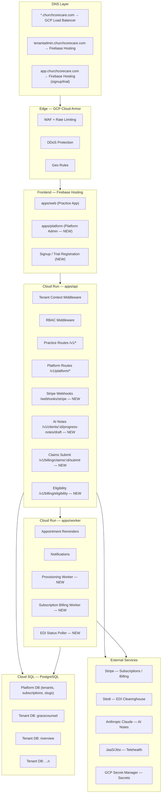

### Tenant Lifecycle Flow

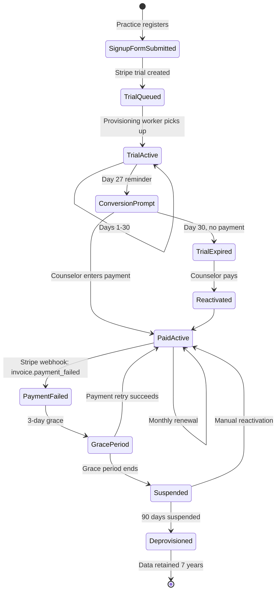

### Subscription Plan Model

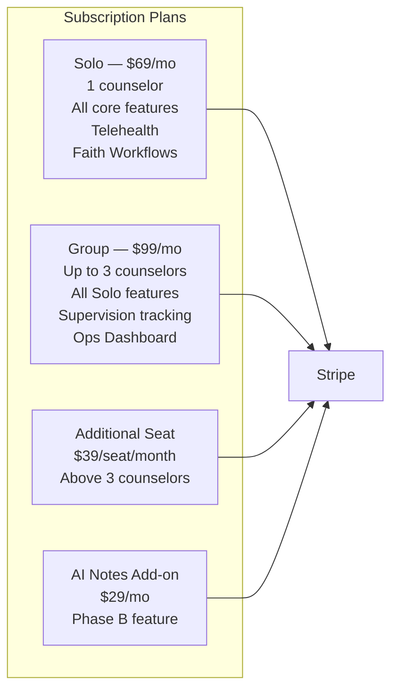

---

## 3. Phase A — Launch Blockers

---

### A1: Multi-Tenant SaaS Phase 4

#### User Story

```
As a ChurchCore Care platform operator,
I want to provision a new counseling practice from signup through
to a fully active, isolated tenant environment,
so that we can onboard paying customers without manual intervention.
```

**Acceptance criteria:**
1. A counselor submits a signup form with practice name, subdomain slug, and email → a provisioning request is created with status `queued`
2. The provisioning worker picks up `queued` requests → transitions to `in_progress` → creates tenant DB schema → creates initial staff_account → transitions to `completed`
3. If provisioning fails, status is `failed` and an alert is logged
4. A `completed` tenant can log in at `<slug>.churchcorecare.com` and access the full practice app
5. Platform admin can view all tenants, their status, and provisioning requests at `/v1/platform/overview`
6. Tenants in `queued` or `in_progress` status cannot authenticate to practice routes
7. A `plan_type` of `trial` limits access to Solo plan features; expiry is enforced

**Out of scope (A1):** Subscription gating by feature, Stripe integration (A2), self-service subdomain slug change

---

#### Technical Spec — A1

**New files needed:**

| File | Purpose |
| --- | --- |
| `apps/worker/src/provision.js` | Provisioning worker — polls queue, runs DB init, creates staff account |
| `apps/api/src/lib/tenant-setup.js` | Tenant schema bootstrap — runs migrations in new tenant DB |
| `apps/api/src/db/queries/tenants.js` | Platform-level tenant queries (lookup by slug, create, update status) |
| `apps/platform/` | Platform Admin React SPA (see A3 for web scaffold) |

**Schema additions needed:**

```sql
-- Platform database (separate from tenant DBs)
-- File: apps/api/src/db/schema-platform.sql

CREATE TABLE IF NOT EXISTS tenant_slugs (
  slug         VARCHAR(64)   NOT NULL,
  tenant_id    VARCHAR(64)   NOT NULL,
  is_active    TINYINT(1)    NOT NULL DEFAULT 1,
  created_at   TIMESTAMP     NOT NULL DEFAULT CURRENT_TIMESTAMP,
  PRIMARY KEY (slug),
  INDEX idx_slug_tenant (tenant_id)
);

CREATE TABLE IF NOT EXISTS subscription_plans (
  id           VARCHAR(64)   NOT NULL,
  name         VARCHAR(64)   NOT NULL,   -- solo | group | group_extra_seat
  stripe_price_id VARCHAR(128) NULL,     -- Stripe price ID
  price_cents  INT           NOT NULL,
  currency     CHAR(3)       NOT NULL DEFAULT 'USD',
  interval     VARCHAR(16)   NOT NULL DEFAULT 'month',
  max_counselors INT         NULL,       -- NULL = unlimited
  created_at   TIMESTAMP     NOT NULL DEFAULT CURRENT_TIMESTAMP,
  PRIMARY KEY (id)
);

CREATE TABLE IF NOT EXISTS tenant_subscriptions (
  id                   VARCHAR(64)   NOT NULL,
  tenant_id            VARCHAR(64)   NOT NULL,
  plan_id              VARCHAR(64)   NOT NULL,
  stripe_subscription_id VARCHAR(128) NULL,
  stripe_customer_id   VARCHAR(128)  NULL,
  status               VARCHAR(32)   NOT NULL DEFAULT 'trialing',
  trial_ends_at        TIMESTAMP     NULL,
  current_period_end   TIMESTAMP     NULL,
  canceled_at          TIMESTAMP     NULL,
  created_at           TIMESTAMP     NOT NULL DEFAULT CURRENT_TIMESTAMP,
  updated_at           TIMESTAMP     NOT NULL DEFAULT CURRENT_TIMESTAMP ON UPDATE CURRENT_TIMESTAMP,
  PRIMARY KEY (id),
  UNIQUE KEY uq_tenant_subscription (tenant_id),
  INDEX idx_sub_stripe (stripe_subscription_id)
);
```

**Provisioning worker logic:**

```mermaid
flowchart TD
    Start([Worker polls every 30s]) --> Query[SELECT * FROM tenant_provisioning WHERE status='queued' LIMIT 5]
    Query --> Any{Any queued?}
    Any -- No --> Sleep[Sleep 30s]
    Sleep --> Start
    Any -- Yes --> ForEach[For each request]
    ForEach --> SetInProgress[UPDATE status='in_progress']
    SetInProgress --> CreateDB[Create tenant DB / run schema migrations]
    CreateDB --> DBOk{Success?}
    DBOk -- No --> SetFailed[UPDATE status='failed', log error]
    SetFailed --> Alert[Emit audit event: provisioning.failed]
    DBOk -- Yes --> CreateStaff[INSERT initial platform_admin staff_account]
    CreateStaff --> CreateSub[Create Stripe trial subscription]
    CreateSub --> SetComplete[UPDATE status='completed', completed_at=NOW()]
    SetComplete --> Emit[Emit audit event: tenant.provisioned]
    Emit --> ForEach
```

**Tenant authentication gate:**

```javascript
// apps/api/src/middleware/tenant.js — add provisioning check
// After resolving tenant context:
if (isTenantHostRoutingEnabled()) {
  const subscription = await getTenantSubscription(tenantId);
  if (!subscription || ['canceled', 'suspended'].includes(subscription.status)) {
    writeJson(response, 403, { error: 'Practice account is not active' });
    return;
  }
}
```

**Implementation TODOs — A1:**

- [ ] Create `apps/api/src/db/schema-platform.sql` with `tenant_slugs`, `subscription_plans`, `tenant_subscriptions`
- [ ] Create `apps/api/src/db/queries/tenants.js` — `getTenantBySlug`, `createTenant`, `getTenantSubscription`, `updateTenantSubscription`
- [ ] Create `apps/worker/src/provision.js` — polling loop, DB bootstrap, staff account creation
- [ ] Create `apps/api/src/lib/tenant-setup.js` — run tenant schema migrations programmatically
- [ ] Add subscription status gate to `apps/api/src/middleware/tenant.js`
- [ ] Add `PLATFORM_DB_URL` env var for the shared platform database
- [ ] Write unit tests: `apps/api/test/tenant-provisioning-worker.test.mjs`
- [ ] Write unit tests: `apps/api/test/tenant-subscription-gate.test.mjs`

---

### A2: Stripe Subscription Billing

#### User Story

```
As a practice owner completing signup,
I want to enter my payment details and choose a plan,
so that my practice is billed automatically each month and I
can manage my subscription from my account settings.
```

**Acceptance criteria:**
1. Practice owner can choose Solo ($69/mo) or Group ($99/mo) during or after trial signup
2. Payment is processed via Stripe with a 30-day trial period (no charge until day 31)
3. Stripe sends a webhook on `invoice.paid` → subscription status updated in DB
4. Stripe sends a webhook on `invoice.payment_failed` → tenant enters grace period
5. Practice owner can view current plan, next billing date, and invoice history in account settings
6. Practice owner can upgrade Solo → Group without downtime
7. Trial-only tenants that never convert are suspended at day 30
8. All billing events are written to the audit ledger

**Out of scope (A2):** Metered billing per session, refunds UI (manual via Stripe dashboard), annual discounts

---

#### Technical Spec — A2

**Stripe integration points:**

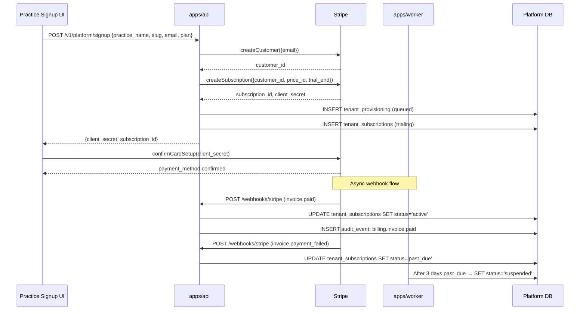

**New files needed:**

| File | Purpose |
| --- | --- |
| `apps/api/src/lib/stripe.js` | Stripe SDK client, plan price IDs, helper functions |
| `apps/api/src/lib/billing-webhooks.js` | Stripe webhook handler — processes all billing events |
| `apps/api/src/db/queries/subscriptions.js` | Subscription CRUD query functions |
| `apps/worker/src/subscription-billing.js` | Dunning logic — grace period → suspend |

**Environment variables:**

```bash
STRIPE_SECRET_KEY=sk_live_...
STRIPE_WEBHOOK_SECRET=whsec_...
STRIPE_SOLO_PRICE_ID=price_...
STRIPE_GROUP_PRICE_ID=price_...
STRIPE_EXTRA_SEAT_PRICE_ID=price_...
STRIPE_TRIAL_DAYS=30
```

**Stripe products to create:**

| Product | Price ID env var | Price | Interval |
| --- | --- | --- | --- |
| ChurchCore Care — Solo | `STRIPE_SOLO_PRICE_ID` | $69.00 | monthly |
| ChurchCore Care — Group | `STRIPE_GROUP_PRICE_ID` | $99.00 | monthly |
| Additional Counselor Seat | `STRIPE_EXTRA_SEAT_PRICE_ID` | $39.00 | monthly |

**Webhook events to handle:**

| Event | Action |
| --- | --- |
| `customer.subscription.created` | Set tenant status = `trialing` |
| `customer.subscription.updated` | Sync plan, period end, status |
| `customer.subscription.deleted` | Set tenant status = `canceled` |
| `invoice.paid` | Set tenant status = `active`, store invoice ref |
| `invoice.payment_failed` | Set tenant status = `past_due`, start grace window |
| `invoice.payment_action_required` | Notify practice owner via email |
| `customer.subscription.trial_will_end` | Send 3-day-before-trial-end email |

**Implementation TODOs — A2:**

- [ ] Install `stripe` npm package in `apps/api`
- [ ] Create Stripe products and prices in Stripe dashboard (test + live)
- [ ] Create `apps/api/src/lib/stripe.js` with SDK init and helper functions
- [ ] Create `POST /webhooks/stripe` route in `apps/api/src/index.js` — raw body required for signature verification
- [ ] Create `apps/api/src/lib/billing-webhooks.js` with handler for each event type
- [ ] Create `POST /v1/platform/signup` route — creates customer, subscription, provisioning request
- [ ] Create `GET /v1/billing/subscription` — return current plan, status, next billing date
- [ ] Create `POST /v1/billing/subscription/upgrade` — switch plan via Stripe API
- [ ] Create `GET /v1/billing/invoices/history` — return Stripe invoice list
- [ ] Create `apps/worker/src/subscription-billing.js` — poll past_due → suspend after 3 days
- [ ] Write unit tests: `apps/api/test/stripe-webhooks.test.mjs`
- [ ] Add webhook secret validation (Stripe-Signature header)

---

### A3: GCP Production Deployment

#### Architecture — GCP Services

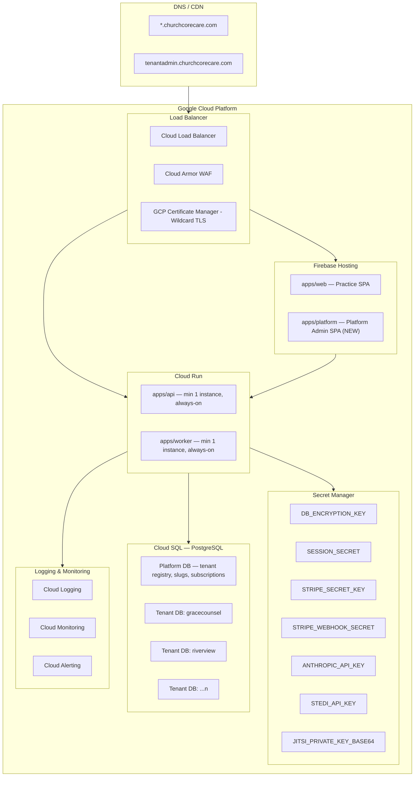

#### Deployment Pipeline

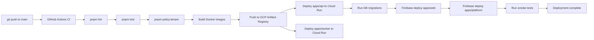

**`.github/workflows/deploy.yml` additions needed:**

```yaml
# Required env secrets in GitHub:
# GCP_PROJECT_ID, GCP_SA_KEY (service account JSON)
# FIREBASE_TOKEN
# Cloud Run service names: CLOUD_RUN_API_SERVICE, CLOUD_RUN_WORKER_SERVICE
```

**Implementation TODOs — A3:**

- [ ] Create `apps/web/Dockerfile` for local production testing (Firebase uses `vite build` output directly)
- [ ] Create `apps/platform/` scaffold — React SPA for platform admin (Vite + Mantine)
- [ ] Update `apps/api/Dockerfile` — add `ENV NODE_ENV=production`
- [ ] Create `ops/deploy-api.sh` — Cloud Run deploy script
- [ ] Create `ops/deploy-worker.sh` — Cloud Run deploy script
- [ ] Update `.github/workflows/deploy.yml` — add build → push → deploy → smoke test pipeline
- [ ] Create `ops/gcp-setup.md` — GCP project setup guide (IAM, Cloud SQL, Secret Manager, Load Balancer)
- [ ] Create `ops/secrets-setup.sh` — Script to seed all secrets into GCP Secret Manager
- [ ] Configure `ENABLE_TENANT_HOST_ROUTING=true` + `TENANT_STRICT_HOST_ROUTING=true` in Cloud Run env
- [ ] Configure GCP Certificate Manager wildcard cert for `*.churchcorecare.com`
- [ ] Configure Cloud Armor WAF rules
- [ ] Set up Cloud SQL platform DB instance (separate from tenant DBs)
- [ ] Write `ops/smoke-test.sh` — post-deploy health check

---

### A4: 30-Day Free Trial Flow

#### User Story

```
As a Christian counselor discovering ChurchCore Care,
I want to sign up for a free 30-day trial with no credit card required,
so that I can evaluate the platform before committing to a subscription.
```

**Acceptance criteria:**
1. Signup page collects: practice name, subdomain slug (validated for uniqueness), owner email, owner password — no credit card at signup
2. On submit → provisioning request created → Stripe trial subscription created → confirmation email sent
3. Trial is fully functional for 30 days — all features accessible (Solo plan limits)
4. Days 27–29: reminder emails sent (Day 27: "3 days left", Day 29: "Tomorrow is your last day")
5. Day 27+: in-app banner appears prompting payment method entry
6. Day 30: if no payment added → tenant status = `trial_expired` → login redirects to conversion page
7. Counselor adds payment info → subscription activates → full access restored immediately
8. Trial counselors who never convert are marked `churned` after 60 days; data retained per retention policy

**Out of scope (A4):** Multiple users during trial, coupon codes, referral tracking

---

#### Technical Spec — A4

**Trial flow architecture:**

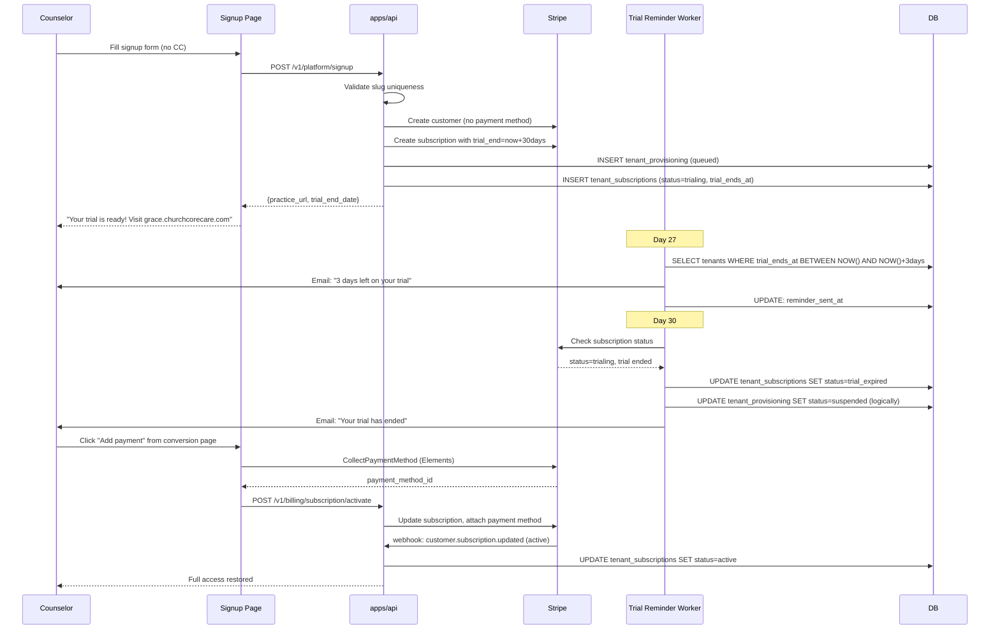

**New API routes:**

| Route | Method | Purpose |
| --- | --- | --- |
| `/v1/platform/signup` | POST | Create trial, provisioning request, Stripe customer |
| `/v1/platform/check-slug` | GET | Check slug availability before signup |
| `/v1/billing/subscription` | GET | Return current subscription status + trial days remaining |
| `/v1/billing/subscription/activate` | POST | Convert trial to paid subscription |
| `/v1/billing/subscription/upgrade` | POST | Change plan |

**Trial status banner logic (frontend):**

```javascript
// apps/web/src/lib/useTrialStatus.js
// Returns: { isTrial, daysRemaining, isExpired, showBanner }
// Banner shown when daysRemaining <= 7 or isExpired
```

**Email templates needed:**

| Template key | Trigger | Subject |
| --- | --- | --- |
| `trial_welcome` | Signup | Welcome to ChurchCore Care — Your trial is ready |
| `trial_reminder_3day` | Day 27 | 3 days left on your ChurchCore Care trial |
| `trial_reminder_1day` | Day 29 | Tomorrow is your last trial day |
| `trial_expired` | Day 30 | Your trial has ended — continue your practice |
| `trial_converted` | Payment added | Welcome to ChurchCore Care — subscription confirmed |

**Implementation TODOs — A4:**

- [ ] Create `apps/web/src/pages/SignupPage.jsx` — trial signup form
- [ ] Create `apps/web/src/pages/TrialExpiredPage.jsx` — conversion prompt
- [ ] Create `apps/web/src/lib/useTrialStatus.js` — hook for trial state
- [ ] Create `apps/web/src/components/TrialBanner.jsx` — top-of-screen warning banner
- [ ] Add trial banner to `apps/web/src/App.jsx`
- [ ] Create `POST /v1/platform/signup` route with Stripe customer + subscription creation
- [ ] Create `GET /v1/platform/check-slug` route
- [ ] Create `GET /v1/billing/subscription` route
- [ ] Create `POST /v1/billing/subscription/activate` route
- [ ] Create `apps/worker/src/trial-reminders.js` — reminder email polling job
- [ ] Add email templates to `apps/worker/src/notify.js`
- [ ] Write unit tests: `apps/api/test/trial-flow.test.mjs`

---

## 4. Phase B — Competitive Parity

---

### B1: AI Session Note Drafting

#### User Story

```
As a counselor completing a session note,
I want the platform to generate a draft note in SOAP, DAP, or BIRP format
based on brief session details I provide,
so that I can spend less time on documentation and more time on care.
```

**Acceptance criteria:**
1. Session note form has an "AI Draft" button that opens a brief-input panel
2. Counselor enters: session duration, presenting concerns (free text), interventions used, client response, and note format preference (SOAP/DAP/BIRP)
3. If client has an active faith profile with integration level `open`, `preferred`, or `required` → AI includes faith-integrated language in the draft
4. AI returns a structured draft note within 10 seconds
5. Counselor can accept, edit, or discard the draft — it never auto-saves
6. Draft request is logged to the audit ledger (`ai.note_draft.generated`) — no PHI in the audit entry
7. AI drafting is available only to counselors with `counselor` or `practice_admin` roles
8. Draft generation works without an internet connection fallback (graceful error if API unavailable)

**Out of scope (B1):** Live session transcription, audio input, automatic note saving

---

#### Technical Spec — B1

**AI integration architecture:**

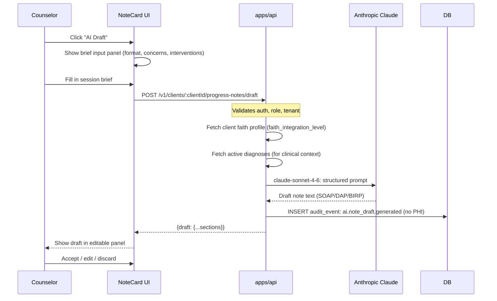

**Prompt architecture:**

```javascript
// apps/api/src/lib/ai-notes.js

const SYSTEM_PROMPT = `You are a licensed clinical documentation assistant
for a faith-integrated Christian counseling practice. Your role is to draft
structured clinical session notes in the requested format.

Rules:
- Never fabricate clinical information not provided
- Use professional clinical language appropriate for licensed counselors
- Include faith-integrated language ONLY when faithIntegrationLevel is
  'open', 'preferred', or 'required'
- SOAP format: Subjective, Objective, Assessment, Plan
- DAP format: Data, Assessment, Plan
- BIRP format: Behavior, Intervention, Response, Plan
- Each section should be 2-4 sentences
- Do not include the client's name or identifying information`;

export async function generateNoteDraft({
  format,           // 'soap' | 'dap' | 'birp'
  sessionDuration,  // minutes
  presentingConcerns,
  interventions,
  clientResponse,
  diagnoses,        // ['F32.1 - Major Depressive Disorder'] - ICD codes only, no names
  faithIntegrationLevel, // 'none' | 'open' | 'preferred' | 'required'
  spiritualPractices,   // ['scripture_reading', 'prayer'] if applicable
}) { ... }
```

**New API route:**

```
POST /v1/clients/:clientId/progress-notes/draft
Auth: counselor or practice_admin role
Body: { format, sessionDuration, presentingConcerns, interventions, clientResponse }
Response: { draft: { subjective?, objective?, assessment, plan, data?, behavior?, intervention?, response? } }
```

**Faith-integrated prompt additions:**

When `faithIntegrationLevel` is `open`/`preferred`/`required`:
- Include section: `spiritualAssessment` — client's spiritual engagement this session
- Include faith-appropriate language in the Plan section (e.g., spiritual practices as homework)
- Reference spiritual practices used in the session

**Schema addition needed:**

```sql
-- Add to progress_notes table migration
ALTER TABLE progress_notes
  ADD COLUMN note_format     VARCHAR(16) NULL,   -- 'soap' | 'dap' | 'birp' | 'narrative'
  ADD COLUMN ai_draft_used   TINYINT(1)  NOT NULL DEFAULT 0;
```

**Implementation TODOs — B1:**

- [ ] Install `@anthropic-ai/sdk` in `apps/api` (check if already present from Audit Intelligence)
- [ ] Create `apps/api/src/lib/ai-notes.js` — prompt construction, Anthropic call, response parsing
- [ ] Add `POST /v1/clients/:clientId/progress-notes/draft` route to `apps/api/src/index.js`
- [ ] Add `note_format` and `ai_draft_used` columns to `progress_notes` migration
- [ ] Create `apps/web/src/components/ClinicalChart/AiNoteDraftPanel.jsx` — brief input + draft display
- [ ] Update `apps/web/src/components/ClinicalChart/tabs/` note form to include AI Draft button
- [ ] Write unit tests: `apps/api/test/ai-notes.test.mjs` (mock Anthropic calls)
- [ ] Add `ANTHROPIC_API_KEY` to GCP Secret Manager (see A3)
- [ ] Add surface to monitoring registry (per PLANS/FULL-SURFACE-MONITORING.md)

---

### B2: EDI Clearinghouse Integration (Stedi)

#### User Story

```
As a practice biller,
I want to submit insurance claims electronically to the clearinghouse
directly from ChurchCore Care,
so that I don't need to re-enter claim data in a separate system.
```

**Acceptance criteria:**
1. Biller can select a submitted invoice and click "Submit to Insurance" to generate and submit an EDI 837P claim
2. Claim is validated before submission — missing NPI, diagnosis codes, or service lines produce a field-level error
3. Submitted claim shows status: `submitted` → `accepted` / `rejected` with payer response
4. Rejected claims show the rejection reason and allow resubmission after corrections
5. ERA (Electronic Remittance Advice) — when payer posts payment, `invoice.status` auto-updates to `paid` and payment is recorded
6. All claim submissions are audit-logged (`claim.submitted`, `claim.accepted`, `claim.rejected`)
7. Claim submission is available only to `practice_admin` and `biller` roles

**Out of scope (B2):** Secondary claim submission, prior authorization, paper claim generation

---

#### Technical Spec — B2

**EDI flow architecture:**

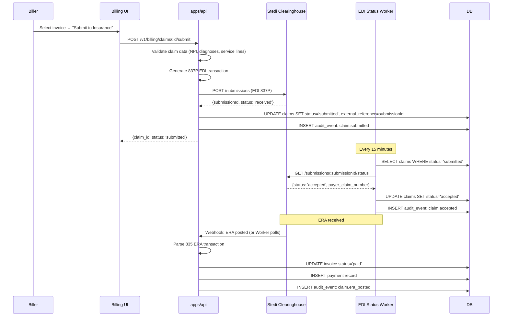

**Stedi API integration points:**

| Endpoint | Purpose |
| --- | --- |
| `POST /api/v1/submissions` | Submit EDI 837P claim |
| `GET /api/v1/submissions/:id` | Check claim status |
| `GET /api/v1/eras` | Poll for ERAs (remittances) |
| `GET /api/v1/eligibility` | Real-time eligibility (shared with B3) |

**837P required data mapping:**

```
Claim → EDI 837P mapping:
  invoice.client_id     → Subscriber (patient)
  client_insurance.*    → Payer + subscriber info
  invoice.line_items    → CLM segment + service lines
  client_diagnoses.*    → HI segment (ICD-10 codes)
  service_codes.code    → SV1 segment (CPT codes)
  staff_member.npi      → Rendering provider NPI
  practice.npi          → Billing provider NPI (add NPI to practices table)
```

**Schema additions needed:**

```sql
-- Add to practices table
ALTER TABLE practices ADD COLUMN npi VARCHAR(16) NULL;

-- Add to claims table
ALTER TABLE claims
  ADD COLUMN stedi_submission_id VARCHAR(128) NULL,
  ADD COLUMN payer_claim_number   VARCHAR(128) NULL,
  ADD COLUMN rejection_reason     TEXT         NULL,
  ADD COLUMN era_received_at      TIMESTAMP    NULL;
```

**Implementation TODOs — B2:**

- [ ] Sign up for Stedi clearinghouse account (stedi.com) — get API key
- [ ] Add `STEDI_API_KEY` to `.env.example` and GCP Secret Manager
- [ ] Create `apps/api/src/lib/stedi.js` — Stedi HTTP client wrapper
- [ ] Create `apps/api/src/lib/edi-837p.js` — EDI 837P transaction builder
- [ ] Create `apps/api/src/lib/era-parser.js` — EDI 835 ERA parser
- [ ] Add `POST /v1/billing/claims/:id/submit` route
- [ ] Add `GET /v1/billing/claims/:id/status` route
- [ ] Create `apps/worker/src/edi-status-poller.js` — polls Stedi every 15 minutes
- [ ] Add NPI column to `practices` migration
- [ ] Add `stedi_submission_id`, `payer_claim_number`, `rejection_reason`, `era_received_at` to claims migration
- [ ] Create `apps/web/src/components/Billing/` — `ClaimsList.jsx`, `ClaimCard.jsx`, `ClaimSubmitButton.jsx`
- [ ] Write unit tests: `apps/api/test/edi-claim-submission.test.mjs`
- [ ] Add billing surface to monitoring registry

---

### B3: Insurance Eligibility Verification

#### User Story

```
As a practice scheduler,
I want to verify a client's insurance eligibility in real time
before scheduling an appointment,
so that we avoid scheduling sessions that won't be covered.
```

**Acceptance criteria:**
1. From client insurance record or appointment scheduler, staff can click "Verify Eligibility"
2. System queries the clearinghouse (Stedi 270/271 transaction) using the client's insurance data
3. Response shows: active/inactive coverage, copay, deductible met/remaining, covered services
4. Verification result is stored on the `client_insurance` record (`verified_on`, `verified_by`, and new `eligibility_response_enc`)
5. Appointment creation warns if most recent eligibility check is >30 days old
6. Eligibility checks are audit-logged (`insurance.eligibility.verified`)
7. Eligibility verification available to `counselor`, `practice_admin`, `scheduler`, `biller` roles

---

#### Technical Spec — B3

**Eligibility flow:**

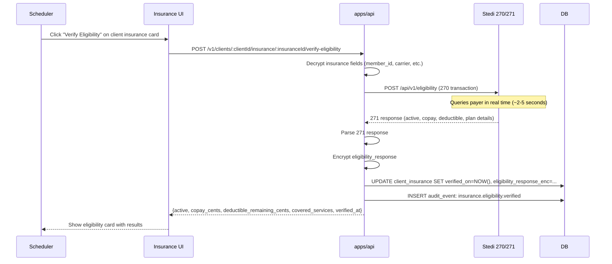

**Schema additions needed:**

```sql
ALTER TABLE client_insurance
  ADD COLUMN eligibility_response_enc TEXT NULL,    -- encrypted 271 response JSON
  ADD COLUMN eligibility_checked_at   TIMESTAMP NULL,
  ADD COLUMN eligibility_status       VARCHAR(32) NULL;  -- 'active' | 'inactive' | 'unknown'
```

**Eligibility response display:**

```
Coverage Active: Yes
Plan: Blue Cross Preferred Gold
Copay: $25.00
Deductible: $500.00 / $500.00 met ($0.00 remaining)
Mental Health: Covered (in-network)
Verified: Today at 2:34 PM
```

**Implementation TODOs — B3:**

- [ ] Create `apps/api/src/lib/eligibility.js` — 270 request builder, 271 response parser
- [ ] Add `POST /v1/clients/:clientId/insurance/:insuranceId/verify-eligibility` route
- [ ] Add `eligibility_response_enc`, `eligibility_checked_at`, `eligibility_status` to client_insurance migration
- [ ] Create `apps/web/src/components/ClientDetail/tabs/EligibilityCard.jsx` — shows eligibility results
- [ ] Update `InsuranceTab.jsx` — add "Verify Eligibility" button and EligibilityCard
- [ ] Add stale eligibility warning to appointment scheduler (>30 days old)
- [ ] Write unit tests: `apps/api/test/insurance-eligibility.test.mjs`

---

## 5. Master TODO Tracker

### Phase A — Must complete before first customer

```
PHASE A: LAUNCH BLOCKERS
═══════════════════════════════════════════════════════════════
Legend: ✅ Done  ☐ Pending (ops/admin/code)  🔧 Admin task only

[A1] MULTI-TENANT SAAS PHASE 4
  Infrastructure
  ✅ A1-1  Migration: tenant_slugs + tenant_subscriptions tables (in migrate.js)
  ✅ A1-2  Create apps/api/src/db/queries/tenants.js
  ✅ A1-3  Create apps/worker/src/provision.js — async provisioning worker (15s poll)
  ✅ A1-4  Create apps/api/src/lib/tenant-setup.js — per-tenant schema bootstrap
  ✅ A1-5  Add subscription status gate to apps/api/src/middleware/tenant.js
  ✅ A1-6  apps/api/test/tenant-provisioning-worker.test.mjs — 8 tests passing
  ✅ A1-7  apps/api/test/tenant-subscription-gate.test.mjs — passing

[A2] STRIPE SUBSCRIPTION BILLING
  Setup
  ✅ A2-1  stripe package installed in apps/api (^22.1.1)
  🔧 A2-2  Create Stripe products/prices in dashboard (solo $69, group $99, seat $39)
  ✅ A2-3  STRIPE_* env vars added to .env.example
  Backend
  ✅ A2-4  Create apps/api/src/lib/stripe.js (lazy init, PLANS, createCustomer, etc.)
  ✅ A2-5  Create POST /webhooks/stripe route (raw body, sig verification)
  ✅ A2-6  Create apps/api/src/lib/billing-webhooks.js — handles 6 Stripe event types
  ✅ A2-7  Create POST /v1/platform/signup route — Stripe customer + provisioning
  ✅ A2-8  Create GET /v1/billing/subscription route
  ✅ A2-9  Create POST /v1/billing/portal route (Billing Portal redirect)
  ✅ A2-10 Create POST /v1/billing/subscription/upgrade route
  ✅ A2-11 Create apps/worker/src/subscription-billing.js — dunning worker
  Tests
  ✅ A2-12 apps/api/test/stripe-webhooks.test.mjs — passing

[A3] GCP PRODUCTION DEPLOYMENT
  Infrastructure (code)
  ✅ A3-1  Complete apps/platform/ React SPA (5 pages: Dashboard, Tenants, Impersonation, Data Exports, Retention Policies)
  ✅ A3-2  Update apps/api/Dockerfile — add ENV NODE_ENV=production
  ✅ A3-3  docs/runbooks/gcp-deployment.md — full GCP project setup guide
  ✅ A3-4  Create ops/secrets-setup.sh — seed GCP Secret Manager
  ✅ A3-5  Create ops/deploy-api.sh — Cloud Run deploy script
  ✅ A3-6  Create ops/deploy-worker.sh — Cloud Run deploy script
  ✅ A3-7  Update .github/workflows/deploy.yml — full CI/CD pipeline (staging + prod)
  Infrastructure (admin)
  🔧 A3-8  Configure GCP: Load Balancer, Cloud Armor, Certificate Manager
  🔧 A3-9  Create Cloud SQL platform DB instance
  🔧 A3-10 Configure wildcard DNS *.churchcorecare.com
  🔧 A3-11 Sign GCP HIPAA BAA (admin.google.com → HIPAA)
  ✅ A3-12 Create ops/smoke-test.sh — post-deploy health check
  Docs
  ✅ A3-13 Create docs/runbooks/gcp-incident-response.md
  ✅ A3-14 Create docs/runbooks/tenant-provisioning-manual.md

[A4] 30-DAY FREE TRIAL FLOW
  Backend
  ✅ A4-1  Create GET /v1/platform/check-slug route
  ✅ A4-2  GET /v1/billing/subscription — returns status + trial_ends_at
  ✅ A4-3  Create POST /v1/billing/subscription/activate route
  ✅ A4-4  Create apps/worker/src/trial-reminders.js
  ✅ A4-5  Add welcome + payment-failed email templates to apps/worker/src/notify.js
  Frontend
  ✅ A4-6  Create apps/web/src/components/SignupPage.jsx
  ✅ A4-7  Create apps/web/src/components/TrialExpiredPage.jsx
  ✅ A4-8  Create apps/web/src/lib/useTrialStatus.js
  ✅ A4-9  Create apps/web/src/components/TrialBanner.jsx
  ✅ A4-10 Wire TrialBanner into apps/web/src/App.jsx
  Tests
  ✅ A4-11 apps/api/test/trial-flow.test.mjs — passing

═══════════════════════════════════════════════════════════════
PHASE A TOTAL: 31 tasks  |  ✅ 27 done  |  🔧 4 admin tasks remaining
```

### Phase B — Must complete within 90 days of launch

```
PHASE B: COMPETITIVE PARITY
═══════════════════════════════════════════════════════════════
Legend: ✅ Done  ☐ Pending (ops/admin/code)  🔧 Admin task only

[B1] AI SESSION NOTE DRAFTING
  Backend
  ✅ B1-1  @anthropic-ai/sdk ^0.98.0 installed in apps/api
  ✅ B1-2  Create apps/api/src/lib/ai-notes.js (buildPrompt + draftSessionNote)
  ✅ B1-3  Add POST /v1/clients/:id/progress-notes/draft (gated by AI_NOTES_ENABLED)
  ✅ B1-4  Migration: note_format VARCHAR(32), ai_draft_used BOOLEAN to progress_notes
  Frontend
  ✅ B1-5  Create apps/web/src/components/ClinicalChart/AiNoteDraftPanel.jsx
  ✅ B1-6  Add AI Draft Collapse panel to SessionNotesTab.jsx (populates summary field)
  ✅ B1-7  Faith-integrated prompt path: checks faith_integration_level from DB
  Tests
  ✅ B1-8  apps/api/test/ai-notes.test.mjs — 8 tests passing
  Monitoring
  ✅ B1-9  AI Notes + AI draft surfaces added to PLANS/FULL-SURFACE-MONITORING.md

[B2] EDI CLEARINGHOUSE (STEDI)
  Setup
  🔧 B2-1  Sign up for Stedi account, get API key
  ✅ B2-2  STEDI_API_KEY added to .env.example
  Backend
  ✅ B2-3  Create apps/api/src/lib/stedi.js — HTTP client + 837P builder + ERA + eligibility
  ☐  B2-4  edi-837p.js standalone split (optional — 837P logic already in stedi.js)
  ☐  B2-5  era-parser.js standalone split (optional — ERA logic already in stedi.js)
  ✅ B2-6  Add POST /v1/billing/claims/:id/submit route
  ✅ B2-7  Add GET /v1/billing/claims/:id/status route
  ✅ B2-8  Create apps/worker/src/edi-status-poller.js — wired into worker poll loop
  ✅ B2-9  Migration: NPI column to practices table
  ✅ B2-10 Migration: stedi_submission_id, payer_claim_number, rejection_reason, era_received_at to claims
  Frontend
  ✅ B2-11 Create apps/web/src/components/Billing/ClaimsList.jsx
  ✅ B2-12 Create apps/web/src/components/Billing/ClaimCard.jsx
  ✅ B2-13 Create apps/web/src/components/Billing/ClaimSubmitButton.jsx
  Tests
  ✅ B2-14 apps/api/test/edi-claim-submission.test.mjs — passing

[B3] INSURANCE ELIGIBILITY
  Backend
  ✅ B3-1  Create apps/api/src/lib/eligibility.js
  ✅ B3-2  Add GET+POST /v1/clients/:id/insurance/:id/verify-eligibility route
  ✅ B3-3  Migration: eligibility_response_enc, eligibility_checked_at, eligibility_status to client_insurance
  Frontend
  ✅ B3-4  Create apps/web/src/components/ClientDetail/tabs/EligibilityCard.jsx
  ✅ B3-5  Update InsuranceTab.jsx — EligibilityCard rendered per insurance record
  ✅ B3-6  Add stale eligibility warning to appointment scheduler (>30 days)
  Tests
  ✅ B3-7  apps/api/test/insurance-eligibility.test.mjs — 7 tests passing

═══════════════════════════════════════════════════════════════
PHASE B TOTAL: 23 tasks  |  ✅ 21 done  |  🔧 1 admin task  |  ☐ 2 optional splits
COMBINED TOTAL: 54 tasks  |  ✅ 48 done  |  🔧 5 admin tasks  |  ☐ 2 optional

Last updated: May 28, 2026 — 195/195 unit tests pass — apps/platform/ complete
```

---

## 6. ADR Index

| ADR | Decision | Rationale |
| --- | --- | --- |
| [ADR-0003](adr/0003-stripe-for-subscriptions.md) | Use Stripe for subscription billing | Market-standard, HIPAA BAA available, best-in-class webhooks |
| [ADR-0004](adr/0004-stedi-clearinghouse.md) | Use Stedi for EDI clearinghouse | API-first, transparent pricing, 837P/270/271/835 support |
| [ADR-0005](adr/0005-platform-db-separation.md) | Separate platform DB from tenant DBs | Platform data (slugs, subscriptions) must never co-reside with PHI |
| [ADR-0006](adr/0006-ai-notes-claude.md) | Use Claude claude-sonnet-4-6 for note drafting | Already integrated for Audit Intelligence; faith-aware system prompt |
| [ADR-0007](adr/0007-trial-no-cc-required.md) | 30-day trial requires no credit card | Conversion optimization; lowers signup friction for counselors |

---

## 7. How-To Guides

### How to provision a new tenant manually

Use when the provisioning worker fails or for testing:

```bash
# 1. Create the tenant DB (PostgreSQL)
createdb churchcore_<slug>

# 2. Run migrations against new DB
DATABASE_URL=postgresql://.../<slug> node apps/api/src/db/migrate.js

# 3. Create initial staff account
node ops/seed-tenant.mjs --slug <slug> --email <owner@email.com> --name "Practice Name"

# 4. Update provisioning status
psql $PLATFORM_DB_URL -c "UPDATE tenant_provisioning SET status='completed', completed_at=NOW() WHERE requested_tenant_id='<slug>'"

# 5. Create Stripe subscription
node ops/activate-stripe-subscription.mjs --tenant <slug> --plan solo
```

### How to run the full Phase A feature set locally

```bash
# 1. Copy env template
cp .env.example .env
# Fill in: STRIPE_SECRET_KEY, PLATFORM_DB_URL, ANTHROPIC_API_KEY

# 2. Start the full stack
pnpm start

# 3. Run Phase A smoke tests
node ops/step11-smoke.mjs
node ops/step12-validate.mjs

# 4. Test Stripe webhooks locally (requires stripe CLI)
stripe listen --forward-to localhost:3001/webhooks/stripe
```

### How to submit a test EDI claim to Stedi sandbox

```bash
# 1. Ensure STEDI_API_KEY is set in .env
# 2. Create a test invoice with client + insurance + service codes
# 3. Submit via API
curl -X POST http://localhost:3001/v1/billing/claims/<id>/submit \
  -H "Cookie: session=<valid_session>" \
  -H "x-csrf-token: <token>"

# 4. Check status
curl http://localhost:3001/v1/billing/claims/<id>/status \
  -H "Cookie: session=<valid_session>"
```

### How to test AI note drafting

```bash
# 1. Ensure ANTHROPIC_API_KEY is set
# 2. Create a session note for a client
# 3. Call the draft endpoint
curl -X POST http://localhost:3001/v1/clients/<clientId>/progress-notes/draft \
  -H "Content-Type: application/json" \
  -H "Cookie: session=<valid_session>" \
  -H "x-csrf-token: <token>" \
  -d '{
    "format": "soap",
    "sessionDuration": 50,
    "presentingConcerns": "Client reports ongoing anxiety related to work transitions",
    "interventions": "Cognitive restructuring, breathing exercises, scripture reflection",
    "clientResponse": "Engaged and receptive, practiced breathing technique in session"
  }'
```

### How to validate the GCP deployment

```bash
# After deploy.yml runs:
# 1. Check API health
curl https://api.churchcorecare.com/health

# 2. Check tenant routing
curl -H "Host: demo.churchcorecare.com" https://api.churchcorecare.com/health

# 3. Verify Stripe webhook endpoint is reachable
stripe trigger invoice.paid --api-key $STRIPE_SECRET_KEY

# 4. Verify Stedi connectivity
curl -H "Authorization: Key $STEDI_API_KEY" https://healthcare.us.stediapi.com/api/v1/ping
```
